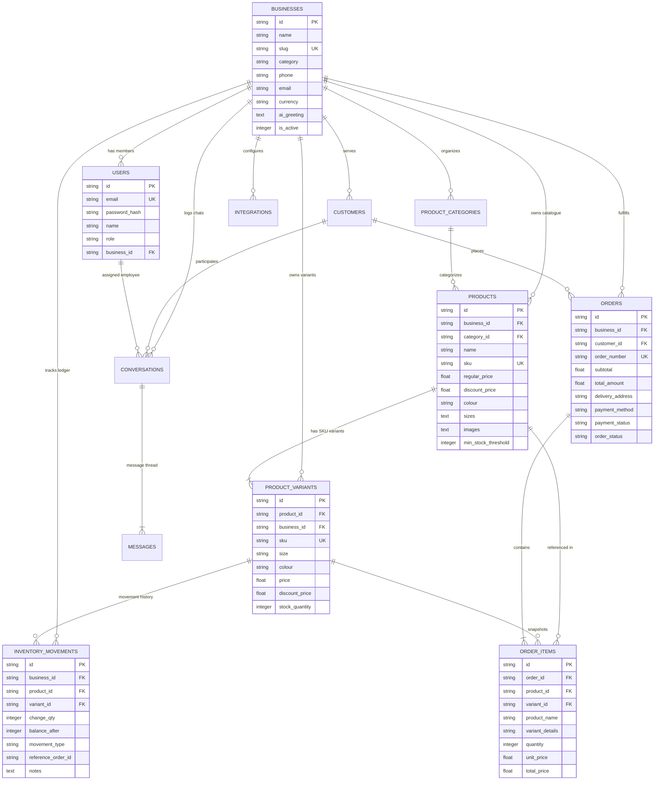

# ShopMate AI - Database Entity Relationship Diagram (ERD)

```mermaid
erDiagram
    BUSINESSES ||--o{ USERS : "has members"
    BUSINESSES ||--o{ PRODUCT_CATEGORIES : "organizes"
    BUSINESSES ||--o{ PRODUCTS : "owns catalogue"
    BUSINESSES ||--o{ PRODUCT_VARIANTS : "owns variants"
    BUSINESSES ||--o{ INVENTORY_MOVEMENTS : "tracks ledger"
    BUSINESSES ||--o{ CUSTOMERS : "serves"
    BUSINESSES ||--o{ ORDERS : "fulfills"
    BUSINESSES ||--o{ CONVERSATIONS : "logs chats"
    BUSINESSES ||--o{ INTEGRATIONS : "configures"

    PRODUCT_CATEGORIES ||--o{ PRODUCTS : "categorizes"
    PRODUCTS ||--|{ PRODUCT_VARIANTS : "has SKU variants"
    PRODUCTS ||--o{ ORDER_ITEMS : "referenced in"
    PRODUCT_VARIANTS ||--o{ ORDER_ITEMS : "snapshots"
    PRODUCT_VARIANTS ||--o{ INVENTORY_MOVEMENTS : "movement history"

    CUSTOMERS ||--o{ ORDERS : "places"
    CUSTOMERS ||--o{ CONVERSATIONS : "participates"
    ORDERS ||--|{ ORDER_ITEMS : "contains"
    CONVERSATIONS ||--|{ MESSAGES : "message thread"
    USERS ||--o{ CONVERSATIONS : "assigned employee"

    BUSINESSES {
        string id PK
        string name
        string slug UK
        string category
        string phone
        string email
        string currency
        text ai_greeting
        integer is_active
    }

    USERS {
        string id PK
        string email UK
        string password_hash
        string name
        string role
        string business_id FK
    }

    PRODUCTS {
        string id PK
        string business_id FK
        string category_id FK
        string name
        string sku UK
        float regular_price
        float discount_price
        string colour
        text sizes
        text images
        integer min_stock_threshold
    }

    PRODUCT_VARIANTS {
        string id PK
        string product_id FK
        string business_id FK
        string sku UK
        string size
        string colour
        float price
        float discount_price
        integer stock_quantity
    }

    INVENTORY_MOVEMENTS {
        string id PK
        string business_id FK
        string product_id FK
        string variant_id FK
        integer change_qty
        integer balance_after
        string movement_type
        string reference_order_id
        text notes
    }

    ORDERS {
        string id PK
        string business_id FK
        string customer_id FK
        string order_number UK
        float subtotal
        float total_amount
        string delivery_address
        string payment_method
        string payment_status
        string order_status
    }

    ORDER_ITEMS {
        string id PK
        string order_id FK
        string product_id FK
        string variant_id FK
        string product_name
        string variant_details
        integer quantity
        float unit_price
        float total_price
    }
```
